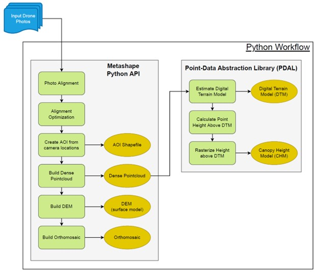
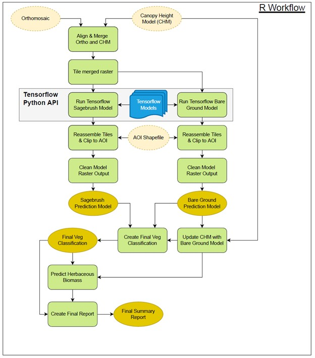

# MT-TNC_Drone
The objective of this project was to develop a revised and simplified UAV Data Processing workflow with documentation/technical guide outlining the automated analysis of the Montana Chapter of The Nature Conservancy’s (TNC’s) UAV imagery.
The goal was to implement a semi-automated system where TNC staff could collect UAV imagery and run the raw images through a system of scripts & software programs for processing.
Inputs: raw jpeg images (georeferenced) from DJI Phantom 4 Pro (25-acre plots flown @ 200ft high)
Outputs/Products: a system of algorithms and semi-automated tools to processes UAV imagery, create point cloud/canopy height models, classify vegetation cover types, generate summary statistics, and produce the following outputs:
 - DEM/DSM/CHM rasters
 - 	Cover class raster identifying Sagebrush (silver sagebrush & big sagebrush), Sparse/Bare ground, and Grasses
 - Herbaceous Biomass raster (lbs/ac)
 - Summary statistics for each plot in tabular form (% cover for sagebrush & sparse/bare ground, herbaceous biomass)
 - Technical guide describing the processing workflow.

The deliverable for this project was a newly-designed, automated, and simplified UAV Data Processing Workflow with documentation and a technical guide for implementation of the workflow. With the new workflow, TNC staff could collect UAV imagery and run the raw images through a system of scripts & software programs for processing and summary reporting. This project was initiated to redevelop and simplify an existing UAV processing workflow that was overly complex and could not be made to run due to its complexity and software (and dependency) version requirements.

We developed the UAV Data Processing Workflow using a combination of Python 3.10.4 and R 4.1.3. Simplification of the workflow took three forms. First, we eliminated unnecessary options and products from the processing workflow which resulted in much faster processing, less required memory and disk storage space, and a more robust workflow less prone to failure. Second, we minimized the use of external programs and 3rd-party libraries wherever possible. Third, we used the Anaconda virtualization environment (version 2021.11) to make it easier to deploy the workflow on different computers. Anaconda allows for separate containers (i.e., environments) to be set up with specific versions of software (e.g., Python, R) and libraries. Anaconda environments can be packaged up (i.e., compressed into a single file) and shared to other computers. Because Anaconda is cross-platform compatible (i.e., it works on Windows, Mac, and Linux), a Conda environment will work on almost any computer without needing detailed package install and setup scripts like were used in the original UAV workflow.

The UAV Data Processing Workflow consists of two Conda environments: one for processing the original drone images into standard products, and a second environment for deriving estimates of rangeland monitoring indicators and creating a summary report.

## Part 1: Drone Image Processing Workflow
The first part of the workflow (i.e., first Conda environment), accepts a folder containing all of the drone photos for a site as an input and processes a set of standard spatial data products (Figure 1).

_Figure 1. Part 1 of the UAV Data Processing Workflow occurs in Python 3.x and uses the Agisoft Metashape Python API to process the original drone photos into standard products and then uses the Python Point Data Abstraction Library (PDAL) to calculate the canopy height model. Inputs are shown in blue. Outputs are shown in yellow._

The main software dependencies for this part of the workflow are:
 - Python 3.10.4
 - Agisoft Metashape Python API, Version 0.0.4
 - Point Data Abstraction Library (PDAL) version 3.1.2 with the PDAL python bindings

This part of the UAV Data Processing Workflow starts with aligning the drone photos with Metashape. Photo alignment determines an initial location and orientation of the camera every time a photo was taken and identifies tie points that link two or more photos together. Metashape estimates latitude, longitude, and elevation for every tie point and creates an initial stereo 3D model of the scene. The next step implements some iterative refinement of the stereo model in Metashape to derive the optimized photo alignment from which all other products will be created. At this point, we create a minimum convex polygon around the final camera locations to create the area of interest (AOI) polygon that is used to clip all the image products to create a consistent boundary. The next step in Metashape is constructing the dense point cloud. A grid is placed over the dense point cloud and the average elevation value calculated to derive the digital elevation model (DEM). Finally, the DEM is used to orthorectify the input drone photos which are then merged to create the orthomosaic.

The final part of the first phase of the UAV Data Processing Workflow is creating a canopy height model from the dense point cloud. This is done in Python using PDAL. The digital terrain model (DTM) is estimated by passing a 2.5m moving window over the point cloud and calculating the lowest elevation within the window. The output is then converted to a raster format. The height above the estimated ground surface of any point in the dense cloud is then calculated. A grid is overlaid on these height estimates and the average height calculated to derive the canopy height model (CHM).
### Input:
Raw jpeg images (georeferenced) from DJI Phantom 4 Pro (25-acre plots flown @ 200ft high)
### Outputs/Products:
The outputs from the first part of the UAV Data Processing Workflow are:
 - Dense point cloud (.las file)
 - AOI polygon (shapefile, .shp)
 - DEM, DTM, and CHM (.tif files)
 - Orthomosaic of drone photos (.tif file)

## Part 2: Estimating Rangeland Monitoring Indicators Workflow
The second part of the workflow (i.e., second Conda environment) calculates the standard rangeland monitoring indicators from the products created in part 1 (Figure 2).

_Figure 2. Part 2 of the UAV Data Processing Workflow occurs in R and takes as inputs the products created in the first step (see Figure 1) and creates estimates of shrub cover, bare ground, and herbaceous biomass using TensorFlow AI models and regression modeling that are compiled into a summary report. Inputs from the Python workflow steps are shown in light yellow with the dashed border. New inputs for this part are shown in blue. Outputs are shown in yellow_

The main software dependencies for this part of the workflow are:
 - R version 4.1.3
 - Reticulate R library (1.25) for running Python from within R
 - Python 3.6.15 (needed for specific tensorflow version)
 - Tensorflow 1.9.0 (for running neural network models)
 - Keras 2.2.0 (front-end for neural network models in R)
 - Parallel (4.1.3) and ForEach (1.5.2) R libraries for parallel processing
 - TileManager (0.4.1) R library for splitting input layers into tiles for faster processing

This second part of the UAV Data Processing Workflow uses the products created in the first part to create estimates of rangeland monitoring indicators. First, the Orthomosaic and CHM are merged together and then split into 1024x1024 pixel tiles. Tiling of the input layers is necessary for fast/efficient model predictions with TensorFlow. Once the tiles have been created, parallel processing is set up to allow multiple tiles to be processed at the same time. Each tile is passed to two TensorFlow models, one that predicts sagebrush cover, and the other that predicts bare ground. The resulting model prediction tiles are then reassembled into full site rasters and clipped to the AOI boundary. Model probability values are converted to binary classes (present or absent) to create final sagebrush and bare ground models. Areas predicted to be bare ground but that have a canopy height greater than zero are reclassified as herbaceous vegetation. Then the land cover class rasters (sagebrush, bare ground, herbaceous) are merged to create the final land cover raster. Areas designated as herbaceous vegetation are then run through the herbaceous biomass generalized additive model (GAM) to estimate herbaceous biomass. Finally, summary statistics and tables are created from the final products.

### Inputs:
Orthomosaic, CHM, and AOI from Part 1; compiled TensorFlow models for predicting sagebrush cover and bare ground, compiled herbaceous biomass regression model.

### Outputs/Products:
The outputs from this part of the Workflow are:
 - Cover class raster identifying Sagebrush (silver sagebrush & big sagebrush), Sparse/Bare ground, and Grasses
 - Herbaceous Biomass raster (lbs/ac)
 - Summary statistics for each plot in tabular form (% cover for sagebrush & sparse/bare ground, herbaceous biomass)

## Items to be resolved and next steps
The Workflow functions as is on University of Idaho computers. The following items will need to be fully resolved to deploy the Workflow on TNC computers or servers:
 - Agisoft Metashape Licensing – Currently the Workflow is using the University of Idaho’s floating license for Metashape. TNC’s node-locked license needs to be deactivated from its current install and activated on whatever computer would run the Workflow
 - Testing deployment on TNC computers – The Workflow has been run on several Windows and Linux computers at the University of Idaho, but has not yet been deployed on a TNC computer. This would require TNC installing Anaconda (version 2011.11) on the computer running the Workflow.
 - Minimal technical documentation was created for the Workflow to satisfy the requirements of this project. More thorough documentation and instructions would be useful.

The goal of this initial work developing the UAV Data Processing Workflow was to create a functional and robust pipeline for automated processing of drone imagery. This was accomplished through Python and R scripting. The end result is functional, but it requires Python and R scripting knowledge/comfort to implement. One future step could be to develop a more user-friendly front end interface to the Workflow using a technology like R Shiny or Jupyter Notebooks. This would allow for easier running of the Workflow by a broader group of people within TNC.
